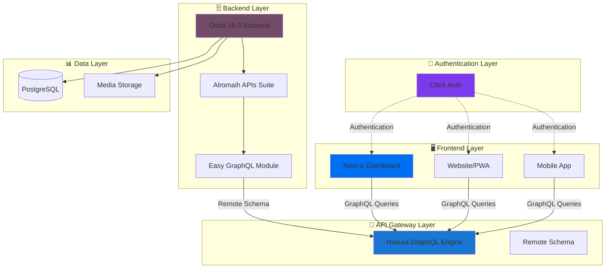

# 🏗️ Alromaih Cars Dashboard Architecture

## 📋 **Architecture Overview**

The Alromaih Cars Dashboard implements a modern, scalable architecture that overcomes traditional Odoo UI limitations by leveraging cutting-edge technologies in a unified GraphQL ecosystem.

## 🌐 **System Architecture**



## 🔧 **Technology Stack**

### **Backend Infrastructure**
- **🐘 Odoo 18.0**: Enterprise ERP backend with automotive models
- **🌐 Alromaih APIs**: 21-module API ecosystem (EKIKA Corporation)
- **📊 Easy GraphQL**: Advanced GraphQL implementation with multilingual support
- **🗄️ PostgreSQL**: Primary database with automotive data models

### **API Gateway Layer**  
- **⚡ Hasura GraphQL Engine**: Unified GraphQL API gateway
- **🔗 Remote Schema**: Seamless Odoo GraphQL integration
- **🚀 Real-time Subscriptions**: Live data synchronization
- **🔒 Permission Layer**: Fine-grained access control

### **Frontend Applications**
- **⚛️ Next.js 15.2.4**: Modern React dashboard with App Router
- **🎨 Tailwind CSS + Radix UI**: Professional design system
- **📱 TypeScript**: Full type safety across applications
- **🌐 PWA Support**: Progressive web app capabilities

### **Authentication & Security**
- **🔐 Clerk**: Modern authentication platform
- **🛡️ Multi-Factor Authentication**: Enterprise security
- **🔑 JWT Tokens**: Secure session management
- **🌍 Social Logins**: OAuth integration

## 🎯 **Key Benefits**

### **🚀 Performance Advantages**
- **GraphQL Efficiency**: Single endpoint, precise data fetching
- **Hasura Caching**: Intelligent query optimization
- **Next.js SSR/SSG**: Optimized rendering strategies
- **CDN Integration**: Global content delivery

### **🛠️ Development Experience**
- **Type Safety**: End-to-end TypeScript integration
- **Hot Reloading**: Instant development feedback
- **GraphQL Introspection**: Auto-generated schemas
- **Modern Tooling**: Latest React ecosystem

### **🌍 Scalability & Internationalization**
- **Arabic-First Design**: RTL support with English fallback
- **Multilingual GraphQL**: @multiLang directive support
- **Microservices Ready**: Modular architecture
- **Cloud Native**: Container-friendly deployment

## 📊 **Data Flow Architecture**

### **1. Authentication Flow**
```typescript
// Clerk Authentication Integration
User Login → Clerk Auth → JWT Token → Hasura Headers → Odoo Validation
```

### **2. Query Execution Flow** 
```typescript
// GraphQL Query Lifecycle
Frontend Query → Hasura Gateway → Remote Schema → Odoo GraphQL → Database
               ↓
Response Processing ← JSON Response ← Multilingual Data ← SQL Query
```

### **3. Real-time Updates**
```typescript
// Subscription Flow
Database Change → Odoo Event → Hasura Subscription → Frontend Update
```

## 🔗 **Integration Patterns**

### **Hasura Remote Schema Configuration**
```yaml
# Hasura Remote Schema Setup
remote_schemas:
  - name: "odoo_automotive"
    definition:
      url: "https://portal.alromaihcars.com/graphql"
      headers:
        x-api-key: "${ODOO_API_KEY}"
        Content-Type: "application/json"
    comment: "Alromaih Cars Odoo Backend"
```

### **Frontend GraphQL Client**
```typescript
// Apollo Client Configuration
const client = new ApolloClient({
  uri: process.env.NEXT_PUBLIC_HASURA_ENDPOINT,
  headers: {
    'Authorization': `Bearer ${clerkToken}`,
    'x-hasura-admin-secret': process.env.HASURA_ADMIN_SECRET
  },
  cache: new InMemoryCache({
    typePolicies: {
      CarBrand: { keyFields: ["id"] },
      Car: { keyFields: ["id"] }
    }
  })
});
```

## 🎨 **UI/UX Architecture**

### **Design System**
- **🎭 Radix UI Primitives**: Accessible component foundation  
- **🎨 Tailwind CSS**: Utility-first styling approach
- **🌙 Dark Mode**: System preference detection
- **📱 Responsive Design**: Mobile-first responsive layouts

### **Component Architecture**
```typescript
// Component Hierarchy
components/
├── ui/           # Radix-based design system
├── forms/        # React Hook Form integration  
├── charts/       # Recharts data visualization
├── tables/       # Advanced data tables
└── layout/       # Application layout components
```

## 🔐 **Security Architecture**

### **Multi-Layer Security**
```typescript
// Security Stack
Frontend (Clerk) → API Gateway (Hasura) → Backend (Odoo APIs) → Database (PostgreSQL)
     ↓                    ↓                        ↓                    ↓
   JWT Auth         Permission Rules        API Key Auth         Row-level Security
```

### **Authentication Integration**
```typescript
// Clerk + Hasura Integration
const clerkUser = useUser();
const hasuraToken = await clerkUser.getToken("hasura");

// Hasura JWT Claims
{
  "https://hasura.io/jwt/claims": {
    "x-hasura-allowed-roles": ["user", "admin"],
    "x-hasura-default-role": "user",
    "x-hasura-user-id": clerkUser.id
  }
}
```

## 📱 **Multi-Platform Support**

### **Responsive Dashboard**
- **💻 Desktop**: Full-featured admin interface
- **📱 Tablet**: Touch-optimized layouts
- **📞 Mobile**: Progressive web app

### **Native Mobile Integration**
- **⚛️ React Native**: Shared codebase components
- **📊 Apollo Client**: Consistent data layer
- **🔄 Offline Support**: Local caching strategies

## ⚡ **Performance Optimizations**

### **GraphQL Optimizations**
- **🔍 Query Batching**: Multiple queries in single request
- **💾 Response Caching**: Hasura query caching
- **📊 DataLoader Pattern**: N+1 query prevention
- **🎯 Field Selection**: Precise data fetching

### **Frontend Optimizations**
- **⚛️ React Suspense**: Progressive loading
- **🖼️ Image Optimization**: Next.js automatic optimization
- **📦 Code Splitting**: Lazy-loaded components
- **🗂️ Bundle Analysis**: Optimized JavaScript bundles

## 🌍 **Internationalization**

### **Multilingual Data Handling**
```graphql
# Arabic-First GraphQL Queries
query GetCarBrands {
  CarBrand {
    id
    name @multiLang     # {"ar_001": "تويوتا", "en_US": "Toyota"}
    description @multiLang
    display_name        # Server-computed based on locale
  }
}
```

### **Frontend Localization**
```typescript
// Next.js i18n Configuration
const i18nConfig = {
  locales: ['ar', 'en'],
  defaultLocale: 'ar',
  domains: [
    { domain: 'ar.alromaihcars.com', defaultLocale: 'ar' },
    { domain: 'en.alromaihcars.com', defaultLocale: 'en' }
  ]
};
```

## 🚀 **Deployment Architecture**

### **Production Infrastructure**
- **☁️ Cloud Hosting**: Scalable infrastructure
- **🐳 Containerization**: Docker deployment
- **🔄 CI/CD Pipeline**: Automated deployments  
- **📊 Monitoring**: Application performance monitoring

### **Environment Configuration**
```bash
# Production Environment Variables
NEXT_PUBLIC_HASURA_ENDPOINT=https://hasura.alromaihcars.com/v1/graphql
NEXT_PUBLIC_CLERK_PUBLISHABLE_KEY=pk_live_...
HASURA_ADMIN_SECRET=...
ODOO_API_KEY=tHV8od3pntYTwhm8sxpH5U0neV7uBrwe
```

## 📈 **Monitoring & Analytics**

### **Application Monitoring**
- **📊 Hasura Console**: GraphQL analytics
- **🔍 Clerk Dashboard**: Authentication metrics
- **📈 Next.js Analytics**: Performance insights
- **🐛 Error Tracking**: Comprehensive error monitoring

### **Business Intelligence**
- **📋 Custom Dashboards**: Real-time KPIs
- **📊 Data Visualization**: Interactive charts
- **📈 Performance Metrics**: System health monitoring
- **👥 User Analytics**: Behavior tracking

---

This architecture represents a modern, scalable solution that successfully bridges traditional ERP functionality with contemporary web development practices, providing exceptional user experience while maintaining enterprise-grade security and performance. 