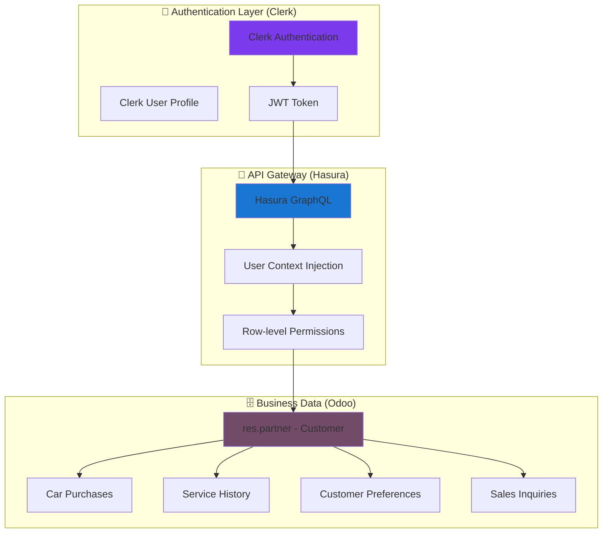

# 👥 Customer Data Integration: Clerk Auth + Odoo Business Data

## 📋 **Overview**

This document explains how **Clerk handles authentication** while **Odoo stores all customer business data**, creating a seamless integration where users authenticate with Clerk but all their automotive data (purchases, preferences, service history) lives in Odoo.

## 🔗 **Integration Architecture**



## 🔄 **Data Flow Explanation**

### **1. User Authentication Flow**
```typescript
// Step 1: User signs in with Clerk
User Login → Clerk Authentication → JWT Token (with Clerk User ID)

// Step 2: JWT sent to Hasura
Frontend Request → Hasura Gateway → JWT Validation → User Context

// Step 3: Hasura forwards to Odoo with user context
Hasura → Odoo GraphQL → Customer Lookup (by clerk_user_id) → Business Data
```

### **2. Customer Data Synchronization**
```python
# Odoo Model Extension
class ResPartner(models.Model):
    _inherit = 'res.partner'
    
    # Link Clerk user to Odoo customer
    clerk_user_id = fields.Char(
        string='Clerk User ID',
        help='Links this customer to their Clerk authentication account'
    )
    
    # Authentication metadata
    clerk_email = fields.Char(string='Clerk Email')
    clerk_phone = fields.Char(string='Clerk Phone')
    last_clerk_sync = fields.Datetime(string='Last Sync with Clerk')
    
    # Customer automotive data (existing Odoo functionality)
    car_purchases = fields.One2many('car.purchase', 'customer_id')
    service_history = fields.One2many('car.service', 'customer_id')
    inquiries = fields.One2many('car.inquiry', 'customer_id')
    preferred_brands = fields.Many2many('car.brand', 'customer_brand_pref_rel')
```

## 🔧 **Implementation Details**

### **1. Customer Synchronization via Webhooks**

```typescript
// app/api/webhooks/clerk/route.ts - Enhanced for customer sync
export async function POST(req: Request) {
  const evt = await verifyWebhook(req);
  
  switch (evt.type) {
    case 'user.created':
      await syncNewCustomerToOdoo(evt.data);
      break;
      
    case 'user.updated':
      await updateCustomerInOdoo(evt.data);
      break;
      
    case 'user.deleted':
      await deactivateCustomerInOdoo(evt.data);
      break;
  }
}

async function syncNewCustomerToOdoo(clerkUser: any) {
  const customerData = {
    clerk_user_id: clerkUser.id,
    name: `${clerkUser.first_name} ${clerkUser.last_name}`,
    email: clerkUser.email_addresses[0].email_address,
    phone: clerkUser.phone_numbers[0]?.phone_number,
    clerk_email: clerkUser.email_addresses[0].email_address,
    is_company: false,
    customer_rank: 1, // Mark as customer
    supplier_rank: 0,
    lang: clerkUser.public_metadata?.preferred_language || 'ar_001'
  };

  // Create customer in Odoo via GraphQL
  const mutation = `
    mutation CreateCustomer($input: CustomerInput!) {
      createCustomer(input: $input) {
        id
        clerk_user_id
        name
        email
      }
    }
  `;

  await executeOdooMutation(mutation, { input: customerData });
}
```

### **2. GraphQL Schema for Customer Integration**

```python
# In Odoo EasyGraphQL schema
def get_customer_graphql_schema(self):
    return """
        type Customer {
            id: Int!
            clerk_user_id: String!
            name: String @multiLang
            email: String
            phone: String
            
            # Automotive business data
            car_purchases: [CarPurchase]
            service_history: [ServiceRecord]
            inquiries: [CustomerInquiry]
            preferred_brands: [CarBrand]
            loyalty_points: Int
            
            # Computed fields
            total_purchases: Float
            last_purchase_date: DateTime
            is_vip_customer: Boolean
        }
        
        type CarPurchase {
            id: Int!
            customer: Customer!
            car: Car!
            purchase_date: DateTime!
            sale_price: Float!
            financing_type: String
            delivery_status: String
        }
        
        type ServiceRecord {
            id: Int!
            customer: Customer!
            car: Car!
            service_date: DateTime!
            service_type: String!
            cost: Float!
            next_service_due: DateTime
        }
        
        input CustomerInput {
            clerk_user_id: String!
            name: String!
            email: String!
            phone: String
            preferred_language: String
        }
        
        extend type Query {
            # Get current user's customer data
            myCustomerProfile: Customer
            
            # Admin queries
            customers(limit: Int, offset: Int): [Customer]
            customer(id: Int!): Customer
            customerByClerkId(clerk_user_id: String!): Customer
        }
        
        extend type Mutation {
            createCustomer(input: CustomerInput!): Customer
            updateCustomerProfile(input: CustomerProfileInput!): Customer
            addCarPurchase(customer_id: Int!, car_id: Int!, purchase_data: PurchaseInput!): CarPurchase
        }
    """
```

### **3. Hasura User Context Injection**

```sql
-- Hasura permission rule for customer data
-- Only allow users to see their own customer data
{
  "clerk_user_id": {
    "_eq": "X-Hasura-User-Id"
  }
}

-- Admin users can see all customers
-- Admin role permission (no restrictions)
{}
```

### **4. Frontend Customer Data Access**

```typescript
// lib/api/queries/customer.ts
import { gql } from '@apollo/client';

export const GET_MY_CUSTOMER_PROFILE = gql`
  query GetMyCustomerProfile {
    myCustomerProfile {
      id
      name
      email
      phone
      
      car_purchases {
        id
        car {
          id
          name
          brand {
            name
          }
        }
        purchase_date
        sale_price
      }
      
      service_history {
        id
        service_date
        service_type
        cost
        car {
          name
        }
      }
      
      preferred_brands {
        id
        name
        logo_url
      }
      
      total_purchases
      loyalty_points
      is_vip_customer
    }
  }
`;

export const UPDATE_CUSTOMER_PREFERENCES = gql`
  mutation UpdateCustomerPreferences($preferences: CustomerPreferencesInput!) {
    updateCustomerProfile(input: $preferences) {
      id
      preferred_brands {
        id
        name
      }
    }
  }
`;
```

### **5. React Customer Dashboard Component**

```typescript
// components/customer/CustomerDashboard.tsx
import { useQuery } from '@apollo/client';
import { useUser } from '@clerk/nextjs';
import { GET_MY_CUSTOMER_PROFILE } from '@/lib/api/queries/customer';

export function CustomerDashboard() {
  const { user } = useUser(); // Clerk user info
  const { data, loading, error } = useQuery(GET_MY_CUSTOMER_PROFILE);

  if (loading) return <CustomerDashboardSkeleton />;
  if (error) return <ErrorMessage error={error} />;

  const customer = data?.myCustomerProfile;

  return (
    <div className="space-y-6" dir="rtl">
      {/* Customer Header with Clerk + Odoo data */}
      <div className="bg-white rounded-lg shadow p-6">
        <div className="flex items-center space-x-4 rtl:space-x-reverse">
          
          <div>
            <h1 className="text-2xl font-bold text-gray-900">
              مرحباً {customer?.name}
            </h1>
            <p className="text-gray-600">{customer?.email}</p>
            {customer?.is_vip_customer && (
              <span className="inline-flex items-center px-2.5 py-0.5 rounded-full text-xs font-medium bg-gold-100 text-gold-800">
                عميل مميز
              </span>
            )}
          </div>
        </div>
      </div>

      {/* Purchase History */}
      <div className="bg-white rounded-lg shadow">
        <div className="p-6">
          <h2 className="text-lg font-medium text-gray-900 mb-4">
            تاريخ المشتريات
          </h2>
          <div className="space-y-4">
            {customer?.car_purchases?.map((purchase) => (
              <div key={purchase.id} className="border rounded-lg p-4">
                <div className="flex justify-between items-start">
                  <div>
                    <h3 className="font-medium">
                      {purchase.car.brand.name} {purchase.car.name}
                    </h3>
                    <p className="text-sm text-gray-600">
                      تاريخ الشراء: {new Date(purchase.purchase_date).toLocaleDateString('ar-SA')}
                    </p>
                  </div>
                  <div className="text-left">
                    <p className="font-bold text-lg">
                      {purchase.sale_price.toLocaleString()} ريال
                    </p>
                  </div>
                </div>
              </div>
            ))}
          </div>
        </div>
      </div>

      {/* Service History */}
      <ServiceHistorySection services={customer?.service_history} />
      
      {/* Loyalty Points */}
      <LoyaltyPointsCard points={customer?.loyalty_points} />
    </div>
  );
}
```

## 🔒 **Security Considerations**

### **1. Data Access Control**

```typescript
// Hasura JWT claims mapping
{
  "https://hasura.io/jwt/claims": {
    "x-hasura-allowed-roles": ["customer", "dealer", "admin"],
    "x-hasura-default-role": "customer",
    "x-hasura-user-id": "{{user.id}}", // Clerk user ID
    "x-hasura-customer-id": "{{user.public_metadata.odoo_customer_id}}"
  }
}
```

### **2. Row-Level Security in Odoo**

```python
# Odoo security rule for customer data
<record id="customer_data_access_rule" model="ir.rule">
    <field name="name">Customer: Own Data Only</field>
    <field name="model_id" ref="model_res_partner"/>
    <field name="domain_force">
        [('clerk_user_id', '=', user.clerk_user_id)]
    </field>
    <field name="groups" eval="[(4, ref('base.group_portal'))]"/>
</record>
```

## 📱 **Mobile App Integration**

### **1. React Native Customer Profile**

```typescript
// screens/CustomerProfileScreen.tsx
import { useQuery } from '@apollo/client';
import { useUser } from '@clerk/clerk-expo';

export function CustomerProfileScreen() {
  const { user } = useUser();
  const { data } = useQuery(GET_MY_CUSTOMER_PROFILE);

  return (
    <ScrollView className="flex-1 bg-gray-50">
      <View className="bg-white p-6 mb-4">
        <View className="flex-row items-center">
          <Image 
            source={{ uri: user?.imageUrl }} 
            className="w-20 h-20 rounded-full"
          />
          <View className="mr-4">
            <Text className="text-xl font-bold">
              {data?.myCustomerProfile?.name}
            </Text>
            <Text className="text-gray-600">
              {data?.myCustomerProfile?.email}
            </Text>
          </View>
        </View>
      </View>
      
      <CustomerPurchaseHistory purchases={data?.myCustomerProfile?.car_purchases} />
      <CustomerServiceHistory services={data?.myCustomerProfile?.service_history} />
    </ScrollView>
  );
}
```

## 🔄 **Data Synchronization Patterns**

### **1. Real-time Updates via Hasura Subscriptions**

```typescript
// Real-time customer data updates
const CUSTOMER_UPDATES_SUBSCRIPTION = gql`
  subscription CustomerUpdates($clerk_user_id: String!) {
    customers(where: {clerk_user_id: {_eq: $clerk_user_id}}) {
      id
      name
      loyalty_points
      car_purchases {
        id
        purchase_date
        car {
          name
        }
      }
      service_history {
        id
        service_date
        service_type
      }
    }
  }
`;

function useCustomerUpdates() {
  const { user } = useUser();
  const { data } = useSubscription(CUSTOMER_UPDATES_SUBSCRIPTION, {
    variables: { clerk_user_id: user?.id }
  });
  
  return data?.customers?.[0];
}
```

### **2. Offline Data Handling**

```typescript
// Apollo Client cache configuration for offline support
const cache = new InMemoryCache({
  typePolicies: {
    Customer: {
      keyFields: ["clerk_user_id"],
      fields: {
        car_purchases: {
          merge(existing = [], incoming) {
            return incoming; // Replace with latest from server
          }
        },
        service_history: {
          merge(existing = [], incoming) {
            return incoming;
          }
        }
      }
    }
  }
});
```

## 📊 **Customer Analytics & Insights**

### **1. Customer Behavior Tracking**

```python
# Odoo computed fields for customer insights
class ResPartner(models.Model):
    _inherit = 'res.partner'
    
    @api.depends('car_purchases.sale_price')
    def _compute_total_purchases(self):
        for customer in self:
            customer.total_purchases = sum(
                purchase.sale_price for purchase in customer.car_purchases
            )
    
    @api.depends('car_purchases')
    def _compute_is_vip_customer(self):
        for customer in self:
            # VIP if purchased more than 3 cars or spent over 500K SAR
            customer.is_vip_customer = (
                len(customer.car_purchases) >= 3 or 
                customer.total_purchases >= 500000
            )
    
    @api.depends('car_purchases.car.brand_id')
    def _compute_preferred_brands(self):
        for customer in self:
            # Calculate most purchased brands
            brand_counts = {}
            for purchase in customer.car_purchases:
                brand = purchase.car.brand_id
                brand_counts[brand] = brand_counts.get(brand, 0) + 1
            
            # Set top 3 brands as preferred
            sorted_brands = sorted(brand_counts.items(), key=lambda x: x[1], reverse=True)
            customer.preferred_brands = [brand for brand, count in sorted_brands[:3]]
```

### **2. Personalized Recommendations**

```typescript
// GraphQL query for personalized car recommendations
export const GET_PERSONALIZED_RECOMMENDATIONS = gql`
  query GetPersonalizedRecommendations {
    myCustomerProfile {
      id
      preferred_brands {
        id
        name
        cars(where: {status: {_eq: "available"}}, limit: 5) {
          id
          name
          price_display
          image_url
          is_featured
        }
      }
      
      # Based on purchase history
      similar_customer_purchases: car_purchases(limit: 3) {
        car {
          similar_cars(limit: 3) {
            id
            name
            brand {
              name
            }
          }
        }
      }
    }
  }
`;
```

## 🚀 **Best Practices**

### **1. Data Consistency**
- ✅ **Single Source of Truth**: Odoo stores all business data
- ✅ **Clerk as Identity Provider**: Only authentication and basic profile
- ✅ **Real-time Sync**: Webhooks for immediate updates
- ✅ **Graceful Degradation**: App works even if sync fails

### **2. Performance Optimization**
- ✅ **GraphQL Field Selection**: Only fetch needed customer data
- ✅ **Caching Strategy**: Cache customer profiles with Apollo
- ✅ **Pagination**: Large datasets like purchase history
- ✅ **Subscription Efficiency**: Only subscribe to current user's data

### **3. Error Handling**
- ✅ **Fallback UI**: Show cached data if network fails
- ✅ **Retry Logic**: Automatic retry for failed syncs
- ✅ **User Feedback**: Clear error messages in Arabic
- ✅ **Admin Monitoring**: Track sync failures and customer issues

---

## 🎯 **Summary**

This integration pattern allows you to:

1. **Leverage Clerk's Modern Auth** - Social logins, MFA, mobile SDKs
2. **Keep Business Logic in Odoo** - All automotive data, pricing, inventory
3. **Seamless User Experience** - Users don't know about the backend complexity
4. **Scalable Architecture** - Each system does what it does best
5. **Security & Compliance** - Row-level security based on authentication

The key is that **Clerk provides the "who"** (authentication) while **Odoo provides the "what"** (customer business data), connected through a secure, traceable user identifier (`clerk_user_id` field in Odoo customers). 